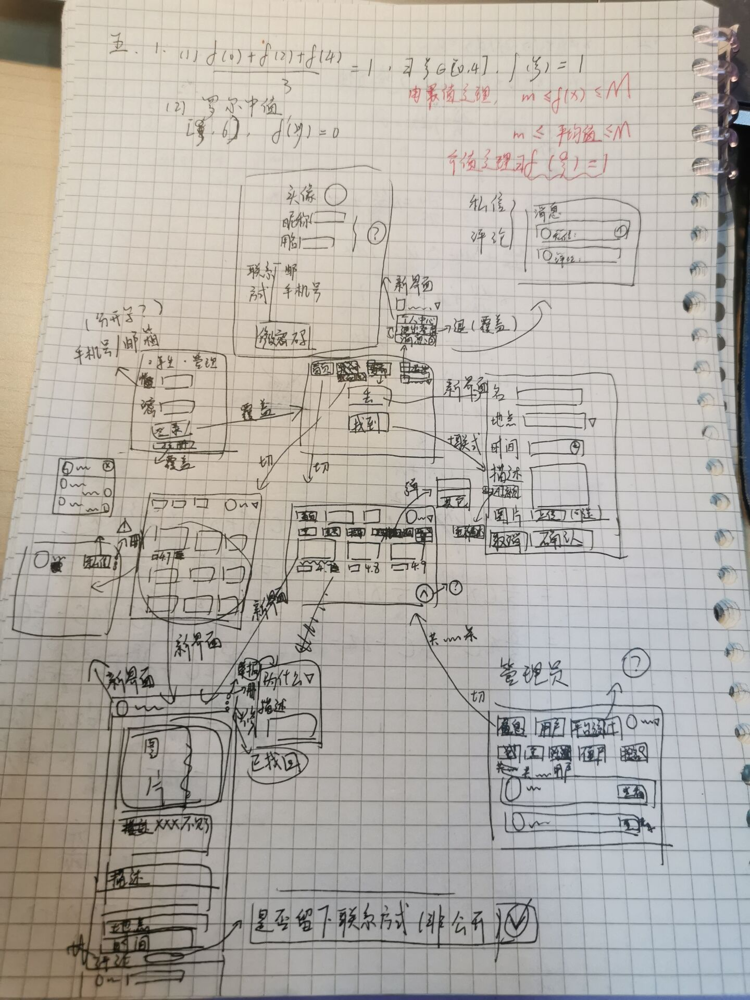

# D1-4月6日

## 决定选题

今天决定了选择第2题。失物招领平台的模式我会更加熟悉一些。

而且感觉很有用，OS：万一这个项目真的能用的话我就能找到我的东西了

## 功能界面构思草图

* 图里面最简单的是罗尔中值定理！



## 新想法

* 再次读题之后有了一些思考，左右脑互搏＋查找资料有了一些答案

  * 引⼊AI辅助：哪块区域的失物较多、哪种物品最近丢的⽐较多

    * 先实现管理端的一个统计功能

  * LLM调⽤超时需有合理处理（如超时时间、失败提⽰） 

    * `CompletableFuture`多线程 我不会，以后再学习
    * `RestTemplate`

  * 配置（如数据库连接、LLMAPIKey）与代码分离，采⽤环境变量形式，不硬编码

    * JWT密钥不能再硬编码了
    * `@Value`读取配置文件yml值

  * 好⼼⼈为什么会在群⾥被“@全体成员”轰炸

    * 因为他不一定是群主/管理员

  * 数据库中不能存储明⽂密码

  * 用户名&昵称

    * 同一个意思吧

  * 信息置顶（占位？

    * 弄一个top栏基于此排序就好
    * 不行，还没好，24h到期呢
    * 还要再设置一个到期时间栏
    * 排序时到期时间和top条件需要同时满足

  * 活跃⽤⼾数

    * 弄一个是否活跃的栏目吧

    ```sql
    create_time > DATE_SUB(NOW(), INTERVAL 7 DAY)
    ```

  * 为什么是发表评论、留下联系⽅式，是有一个特定选项留下联系方式吗

    * 信息分级就可以了
    * 先实现基础功能，暂不考虑
    * 以后再加一个`rate`栏

  * 私聊怎么做啊

    * 要建一个私聊信息表，要有from_user,to_user等
    * 一个表中集齐所有用户的所有聊天内容进行检索，性能会不会很差
      * 小型项目暂时不考虑，OS：我的项目可以投入现实使用中就好了
    * 实时聊天的话似乎需要`WebSocket依赖`先实现简单功能

  * 抵御SQL注入是什么意思

    * 原来就是mybatis转义

  * 后端报错处理

    * 原来就是GlobalExceptionHandler全局异常

  * 可扩展性强，低耦合

    * ` @Autowired`
    * 不硬编码
    * 逻辑不要丢Controller里面

  * 前后端都要使⽤正则表达式校验吗

    * 前端肯定要
    * 后端用注释
      * 建议弄一个DTO请求类，在属性上加注解
      * `@NotBlank(message = "用户名不能为空")`
      * `@Pattern(regexp = "^[0-9]{10}$", message = "学号必须是10位数字")`
      * Controller里用`@Valid`校验

  * 账号封禁要写进用户表的状态栏吗 

    * 对

  * 管理员可以查看发布信息数量、找回物品数量

    * 找回的物品和发布的是不一样的吧
    * 那我要在lost表中加一个找回状态栏

  * 查询的幂等性是什么东西

    * 同一个请求调用多次，结果应该和调用一次一样
    * 前端传唯一ID
    * redis放到内存里，以后再弄吧（x

## 数据库搭建

* 基于胡说八道搭了下面这几个表

### 表1：user（用户表）

| 字段             | 类型         | 必填 | 特殊说明                          |
| :--------------- | :----------- | :--- | :-------------------------------- |
| id               | INT          | ✅    | 主键，自增                        |
| username         | VARCHAR(50)  | ✅    | 唯一，用于登录                    |
| password         | VARCHAR(255) | ✅    | BCrypt加密存储                    |
| nickname         | VARCHAR(50)  | ❌    | 显示用，可空                      |
| email            | VARCHAR(100) | ✅    | 唯一，用于登录/找回密码           |
| phone            | VARCHAR(20)  | ❌    | 手机号，可选                      |
| avatar           | VARCHAR(255) | ❌    | 头像URL                           |
| status           | TINYINT      | ✅    | 0-封禁 1-正常                     |
| is_active        | TINYINT      | ✅    | 0-普通 1-活跃用户（定时任务更新） |
| post_count       | INT          | ✅    | 发布次数，默认0                   |
| comment_count    | INT          | ✅    | 评论次数，默认0                   |
| last_active_time | DATETIME     | ❌    | 最后活跃时间                      |
| create_time      | DATETIME     | ✅    | 创建时间，自动生成                |
| update_time      | DATETIME     | ✅    | 更新时间，自动更新                |

### 表2：admin（管理员表）

* 和user差不多其实

| 字段             | 类型         | 必填 | 特殊说明                |
| :--------------- | :----------- | :--- | :---------------------- |
| id               | INT          | ✅    | 主键，自增              |
| admin_name       | VARCHAR(50)  | ✅    | 唯一，用于登录          |
| password         | VARCHAR(255) | ✅    | BCrypt加密存储          |
| nickname         | VARCHAR(50)  | ❌    | 显示用，可空            |
| email            | VARCHAR(100) | ✅    | 唯一，用于登录/找回密码 |
| phone            | VARCHAR(20)  | ❌    | 手机号，可选            |
| avatar           | VARCHAR(255) | ❌    | 头像URL                 |
| post_count       | INT          | ✅    | 发布次数，默认0         |
| comment_count    | INT          | ✅    | 评论次数，默认0         |
| last_active_time | DATETIME     | ❌    | 最后活跃时间            |
| create_time      | DATETIME     | ✅    | 创建时间，自动生成      |
| update_time      | DATETIME     | ✅    | 更新时间，自动更新      |

### 表3：location（地点表）

| 字段        | 类型         | 必填 | 特殊说明                    |
| :---------- | :----------- | :--- | :-------------------------- |
| id          | INT          | ✅    | 主键，自增                  |
| name        | VARCHAR(100) | ✅    | 地点名称                    |
| parent_id   | INT          | ✅    | 父级ID，0表示顶级，支持层级 |
| is_custom   | TINYINT      | ✅    | 0-系统预置 1-用户自定义     |
| user_id     | INT          | ❌    | 自定义地点的创建者ID        |
| use_count   | INT          | ✅    | 被使用次数，用于热门排序    |
| create_time | DATETIME     | ✅    | 创建时间                    |

------

### 表4：lost_item（失物表）

| 字段            | 类型         | 必填 | 特殊说明                        |
| :-------------- | :----------- | :--- | :------------------------------ |
| id              | INT          | ✅    | 主键，自增                      |
| user_id         | INT          | ✅    | 发布者ID，关联user.id           |
| title           | VARCHAR(100) | ✅    | 物品名称                        |
| location_id     | INT          | ✅    | 地点ID，关联location.id         |
| location_name   | VARCHAR(100) | ❌    | 地点名称快照，冗余存储          |
| lost_time       | DATETIME     | ✅    | 丢失时间                        |
| description     | TEXT         | ❌    | 物品描述（半公开字段）          |
| contact_verify  | VARCHAR(255) | ❌    | 核验字段（仅发布者+管理员可见） |
| image_url       | VARCHAR(255) | ❌    | 图片URL                         |
| is_top          | TINYINT      | ✅    | 0-否 1-是                       |
| top_expire_time | DATETIME     | ❌    | 置顶过期时间                    |
| status          | TINYINT      | ✅    | 0-进行中 1-已找回 2-已关闭      |
| view_count      | INT          | ✅    | 浏览次数                        |
| create_time     | DATETIME     | ✅    | 创建时间                        |
| update_time     | DATETIME     | ✅    | 更新时间                        |

------

### 表5：found_item（拾物表）

| 字段           | 类型         | 必填 | 特殊说明                        |
| :------------- | :----------- | :--- | :------------------------------ |
| id             | INT          | ✅    | 主键，自增                      |
| user_id        | INT          | ✅    | 发布者ID，关联user.id           |
| title          | VARCHAR(100) | ✅    | 物品名称                        |
| location_id    | INT          | ✅    | 地点ID，关联location.id         |
| location_name  | VARCHAR(100) | ❌    | 地点名称快照                    |
| found_time     | DATETIME     | ✅    | 拾取时间                        |
| description    | TEXT         | ❌    | 物品描述（半公开字段）          |
| contact_verify | VARCHAR(255) | ❌    | 核验字段（仅发布者+管理员可见） |
| image_url      | VARCHAR(255) | ❌    | 图片URL                         |
| status         | TINYINT      | ✅    | 0-进行中 1-已归还 2-已关闭      |
| view_count     | INT          | ✅    | 浏览次数                        |
| create_time    | DATETIME     | ✅    | 创建时间                        |
| update_time    | DATETIME     | ✅    | 更新时间                        |

------

### 表6：comment（评论表）

| 字段        | 类型         | 必填 | 特殊说明                          |
| :---------- | :----------- | :--- | :-------------------------------- |
| id          | INT          | ✅    | 主键，自增                        |
| user_id     | INT          | ✅    | 评论人ID，关联user.id             |
| item_id     | INT          | ✅    | 物品ID，关联lost_item或found_item |
| item_type   | TINYINT      | ✅    | 0-失物 1-拾物                     |
| content     | VARCHAR(500) | ✅    | 评论内容                          |
| create_time | DATETIME     | ✅    | 创建时间                          |

------

### 表7：message（私聊消息表）

| 字段         | 类型         | 必填 | 特殊说明              |
| :----------- | :----------- | :--- | :-------------------- |
| id           | INT          | ✅    | 主键，自增            |
| from_user_id | INT          | ✅    | 发送者ID，关联user.id |
| to_user_id   | INT          | ✅    | 接收者ID，关联user.id |
| content      | VARCHAR(500) | ✅    | 消息内容              |
| is_read      | TINYINT      | ✅    | 0-未读 1-已读         |
| create_time  | DATETIME     | ✅    | 创建时间              |

------

### 表8：notification（通知表）- 新增

| 字段         | 类型         | 必填 | 特殊说明                    |
| :----------- | :----------- | :--- | :-------------------------- |
| id           | INT          | ✅    | 主键，自增                  |
| user_id      | INT          | ✅    | 接收者ID，关联user.id       |
| from_user_id | INT          | ❌    | 触发者ID（谁评论/谁发私信） |
| type         | TINYINT      | ✅    | 1-评论 2-私信 3-系统        |
| content      | VARCHAR(500) | ✅    | 通知内容                    |
| target_id    | INT          | ❌    | 关联的帖子ID（评论时使用）  |
| is_read      | TINYINT      | ✅    | 0-未读 1-已读               |
| create_time  | DATETIME     | ✅    | 创建时间                    |

------

### 表9：report（举报表）

| 字段           | 类型         | 必填 | 特殊说明                         |
| :------------- | :----------- | :--- | :------------------------------- |
| id             | INT          | ✅    | 主键，自增                       |
| reporter_id    | INT          | ✅    | 举报人ID，关联user.id            |
| target_user_id | INT          | ❌    | 被举报的用户ID（举报用户时使用） |
| item_id        | INT          | ❌    | 被举报的物品ID（举报帖子时使用） |
| item_type      | TINYINT      | ❌    | 0-失物 1-拾物                    |
| report_type    | TINYINT      | ✅    | 0-举报帖子 1-举报用户            |
| reason         | VARCHAR(255) | ✅    | 举报理由                         |
| status         | TINYINT      | ✅    | 0-待处理 1-已通过 2-已驳回       |
| create_time    | DATETIME     | ✅    | 创建时间                         |
| handle_time    | DATETIME     | ❌    | 处理时间                         |

------

### 表关系汇总

| 主表       | 子表         | 关联字段                                      |
| :--------- | :----------- | :-------------------------------------------- |
| user       | lost_item    | user.id → lost_item.user_id                   |
| user       | found_item   | user.id → found_item.user_id                  |
| user       | comment      | user.id → comment.user_id                     |
| user       | message      | user.id → message.from_user_id / to_user_id   |
| user       | notification | user.id → notification.user_id / from_user_id |
| user       | report       | user.id → report.reporter_id / target_user_id |
| location   | lost_item    | location.id → lost_item.location_id           |
| location   | found_item   | location.id → found_item.location_id          |
| lost_item  | comment      | lost_item.id → comment.item_id (item_type=0)  |
| found_item | comment      | found_item.id → comment.item_id (item_type=1) |


# D2-4月7日

## 新想法

*每天大脑会自己刷新的

*突然想起来还有置顶功能要做

* 在省略号那一栏里面增加
* 但是如果在主页置顶了，在用户自己的界面，也要置顶吗
  * 不要吧，感觉逻辑不一样
* 要在帖子上面显示置顶提示吗
  * 要，而且帖子置顶到期时间在帖子里面也要显示
* 管理员还要处理置顶信息，应该新建一个表

* 表10：top_request（置顶申请表）

| 字段           | 类型     | 必填 | 特殊说明                          |
| :------------- | :------- | :--- | :-------------------------------- |
| id             | INT      | ✅    | 主键，自增                        |
| item_id        | INT      | ✅    | 物品ID，关联lost_item或found_item |
| item_type      | TINYINT  | ✅    | 0-失物 1-拾物                     |
| requester_id   | INT      | ✅    | 申请人ID，关联user.id             |
| duration_hours | INT      | ✅    | 申请置顶时长（小时），默认24      |
| status         | TINYINT  | ✅    | 0-待审批 1-已通过 2-已拒绝        |
| create_time    | DATETIME | ✅    | 创建时间                          |
| approve_time   | DATETIME | ❌    | 审批时间                          |

*消息那一栏还是不要折叠和个人中心一起吧

* 这样管理员有一些待处理信息在顶栏，也挺重要的
  * 置顶申请
  * 黑名单冷冻用户（用户被举报？
  * 举报帖子信息

*用户应该不能搜索其它用户，无意义

*管理员需要的是工号，别的不需要

* 管理员不能发评论吧，那不是上班摸鱼吗

* 表2：admin（管理员表）

| 字段        | 类型         | 必填 | 特殊说明             |
| :---------- | :----------- | :--- | :------------------- |
| id          | INT          | ✅    | 主键，自增           |
| admin_num   | VARCHAR(50)  | ✅    | 工号，唯一，用于登录 |
| password    | VARCHAR(255) | ✅    | BCrypt加密存储       |
| name        | VARCHAR(50)  | ❌    | 姓名                 |
| phone       | VARCHAR(20)  | ❌    | 联系电话             |
| create_time | DATETIME     | ✅    | 创建时间，自动生成   |
| update_time | DATETIME     | ✅    | 更新时间，自动更新   |

*管理员可以注册账号的话，感觉很奇怪欸

* 那还是别注册了

*用户建表

* 异议！登录是用手机号或者邮箱，username是没用的，nickname才是人家的名字，nickname是必填的，但是会有一个默认名，可以后面自己更改，username就去掉吧？
* 异议！手机号也可以登录的
* 异议！注册的时候手机号和邮箱都要填
* 异议！头像既然要显示，那么不能为空，于是它会有一个默认头像
* 这样的user表才是对的嘛（点头

| 字段             | 类型         | 必填 | 特殊说明                           |
| :--------------- | :----------- | :--- | :--------------------------------- |
| id               | INT          | ✅    | 主键，自增                         |
| email            | VARCHAR(100) | ✅    | 邮箱，唯一，用于登录               |
| phone            | VARCHAR(20)  | ✅    | 手机号，唯一，用于登录             |
| password         | VARCHAR(255) | ✅    | BCrypt加密存储                     |
| nickname         | VARCHAR(50)  | ✅    | 昵称，默认"萌新用户"，用户可修改   |
| avatar           | VARCHAR(255) | ✅    | 头像URL，默认`/default-avatar.png` |
| status           | TINYINT      | ✅    | 0-封禁 1-正常                      |
| is_active        | TINYINT      | ✅    | 0-普通 1-活跃用户                  |
| post_count       | INT          | ✅    | 发布次数，默认0                    |
| comment_count    | INT          | ✅    | 评论次数，默认0                    |
| last_active_time | DATETIME     | ❌    | 最后活跃时间                       |
| create_time      | DATETIME     | ✅    | 创建时间                           |
| update_time      | DATETIME     | ✅    | 更新时间                           |

## 前端架构

* 用户的界面还是不要整合到user文件夹里吧，因为和admin有很多重合
* src/
  * main.js                             # 入口文件
  * App.vue                             # 根组件
  * api/                                # API接口层
    * index.js                          # 所有接口
  * router/                             # 路由配置
    * index.js                          # 路由
  * stores/                             # 状态管理（Pinia）
    * user.js                           # 用户状态
  * utils/                              # 工具函数
    * format.js                         # 时间格式化等
    * request.js            # axios 实例 + 拦截器
  * assets/                             # 静态资源
    * images/                           # 图片
    * styles/                           # 全局样式
  * views/                              # 页面组件
    * LoginView.vue                     # 登录页
    * HomeView.vue                      # 首页
    * PostDetail.vue                    # 帖子详情页
    * MyPosts.vue                       # 我的帖子
    * Messages.vue                      # 消息中心
    * PublishView.vue                   # 发布入口（拾取/丢失大按钮）
    * PublishForm.vue                   # 发布表单（失物/拾物）
    * PersonalCenter.vue                # 个人中心
    * UserProfile.vue                   # 用户主页（其他人的）
    * admin/                            # 管理员页面
      * AdminHome.vue                   # 管理员主页
      * UserManage.vue                  # 用户管理
      * Reports.vue                     # 举报管理
      * TopRequests.vue                 # 置顶申请管理
      * Statistics.vue                  # 平台统计（图表）

## 设计接口

### 一、用户模块 (User)

| 方法 | 接口地址               | 说明                                     | 请求参数                                                     | 返回值                                                       |
| :--- | :--------------------- | :--------------------------------------- | :----------------------------------------------------------- | :----------------------------------------------------------- |
| POST | `/api/user/login`      | 用户登录（支持邮箱/手机号）              | `{"account": "xxx@xx.com/13800138000", "password": "xxx"}`   | `{userId, nickname, token}`                                  |
| POST | `/api/user/register`   | 用户注册                                 | `{"nickname": "张三", "email": "xxx@xx.com", "phone": "13800138000", "password": "xxx", "confirmPassword": "xxx"}` | `success`                                                    |
| GET  | `/api/user/info`       | 获取当前用户信息                         | Header: `token`                                              | `{id, nickname, email, phone, avatar, status, postCount, commentCount, ...}` |
| PUT  | `/api/user/info`       | 修改用户信息（昵称、头像、邮箱、手机号） | Header: `token`, Body: `{"nickname": "新昵称", "avatar": "新头像URL", "email": "新邮箱", "phone": "新手机号"}` | `success`                                                    |
| PUT  | `/api/user/password`   | 修改密码                                 | Header: `token`, Body: `{"oldPassword": "xxx", "newPassword": "xxx", "confirmPassword": "xxx"}` | `success`                                                    |
| GET  | `/api/user/posts`      | 获取我的帖子列表                         | Header: `token`                                              | `[{id, type, title, createTime, viewCount, status, isTop, ...}]` |
| GET  | `/api/user/{id}`       | 获取指定用户信息（他人视角）             | `id` 路径参数                                                | `{id, nickname, avatar, postCount, commentCount, isActive}`  |
| GET  | `/api/user/{id}/posts` | 获取指定用户的帖子列表                   | `id` 路径参数                                                | `[{id, type, title, createTime, viewCount}]`                 |

------

### 二、管理员模块 (Admin)

| 方法   | 接口地址                      | 说明                       | 请求参数                                                     | 返回值                                                       |
| :----- | :---------------------------- | :------------------------- | :----------------------------------------------------------- | :----------------------------------------------------------- |
| POST   | `/api/admin/login`            | 管理员登录                 | `{"adminNum": "admin", "password": "xxx"}`                   | `{id, adminNum, name, token}`                                |
| GET    | `/api/admin/info`             | 获取管理员信息             | Header: `token`                                              | `{id, adminNum, name, phone, ...}`                           |
| PUT    | `/api/admin/info`             | 修改管理员信息             | Header: `token`, Body: `{"name": "新姓名", "phone": "新手机号"}` | `success`                                                    |
| PUT    | `/api/admin/password`         | 管理员修改密码             | Header: `token`, Body: `{"oldPassword": "xxx", "newPassword": "xxx"}` | `success`                                                    |
| GET    | `/api/admin/users`            | 获取所有用户列表           | Header: `token`, Query: `?keyword=xxx&status=xxx`            | `[{id, nickname, email, phone, status, postCount, commentCount, createTime}]` |
| PUT    | `/api/admin/user/{id}/ban`    | 封禁/解封用户              | Header: `token`, Body: `{"status": 0/1}`                     | `success`                                                    |
| DELETE | `/api/admin/user/{id}`        | 删除用户（及所有关联数据） | Header: `token`                                              | `success`                                                    |
| GET    | `/api/admin/reports`          | 获取举报列表               | Header: `token`, Query: `?status=0/1/2`                      | `[{id, reporterName, targetUserName, reason, status, createTime, ...}]` |
| PUT    | `/api/admin/report/{id}`      | 处理举报                   | Header: `token`, Body: `{"action": "approve/reject"}`        | `success`                                                    |
| GET    | `/api/admin/top-requests`     | 获取置顶申请列表           | Header: `token`, Query: `?status=0/1/2`                      | `[{id, postTitle, requesterName, durationHours, status, createTime}]` |
| PUT    | `/api/admin/top-request/{id}` | 审批置顶申请               | Header: `token`, Body: `{"approved": true/false}`            | `success`                                                    |
| GET    | `/api/admin/statistics`       | 获取平台统计数据           | Header: `token`                                              | `{totalPosts, totalLost, totalFound, totalResolved, totalUsers, activeUsers, topLocations: [{name, count}]}` |

------

### 三、帖子模块 (Post)

| 方法   | 接口地址                        | 说明                      | 请求参数                                                     | 返回值                                                       |
| :----- | :------------------------------ | :------------------------ | :----------------------------------------------------------- | :----------------------------------------------------------- |
| POST   | `/api/lost/create`              | 发布失物                  | Header: `token`, Body: `{"title": "xxx", "locationId": 1, "lostTime": "2024-01-01 12:00:00", "description": "xxx", "imageUrl": "xxx"}` | `{id, createTime}`                                           |
| POST   | `/api/found/create`             | 发布拾物                  | Header: `token`, Body: `{"title": "xxx", "locationId": 1, "foundTime": "2024-01-01 12:00:00", "description": "xxx", "imageUrl": "xxx"}` | `{id, createTime}`                                           |
| GET    | `/api/feed/list`                | 首页列表（合并失物+拾物） | Query: `?type=all/lost/found&keyword=xxx&sort=desc/asc&locationId=1&page=1&size=20` | `{total, list: [{id, type, title, userNickname, createTime, isTop, viewCount}]}` |
| GET    | `/api/lost/{id}`                | 获取失物详情              | `id` 路径参数，Header: `token`                               | `{id, userId, userNickname, userAvatar, title, locationName, lostTime, description, imageUrl, isTop, status, viewCount, createTime}` |
| GET    | `/api/found/{id}`               | 获取拾物详情              | `id` 路径参数，Header: `token`                               | `{id, userId, userNickname, userAvatar, title, locationName, foundTime, description, imageUrl, status, viewCount, createTime}` |
| PUT    | `/api/post/{type}/{id}`         | 修改帖子                  | Header: `token`, `type=0/1`, Body: `{"title": "xxx", "locationId": 1, "time": "xxx", "description": "xxx"}` | `success`                                                    |
| DELETE | `/api/post/{type}/{id}`         | 删除帖子                  | Header: `token`, `type=0/1`                                  | `success`                                                    |
| PUT    | `/api/post/{type}/{id}/resolve` | 标记已找回/已归还         | Header: `token`, `type=0/1`                                  | `success`                                                    |

------

### 四、地点模块 (Location)

| 方法 | 接口地址         | 说明             | 请求参数                                                | 返回值                                    |
| :--- | :--------------- | :--------------- | :------------------------------------------------------ | :---------------------------------------- |
| GET  | `/api/locations` | 获取地点树形列表 | 无                                                      | `[{id, name, parentId, children: [...]}]` |
| POST | `/api/location`  | 添加自定义地点   | Header: `token`, Body: `{"name": "xxx", "parentId": 1}` | `{id}`                                    |

------

### 五、AI模块

| 方法 | 接口地址           | 说明           | 请求参数                                                     | 返回值                              |
| :--- | :----------------- | :------------- | :----------------------------------------------------------- | :---------------------------------- |
| POST | `/api/ai/complete` | AI补全物品描述 | Header: `token`, Body: `{"type": 0/1, "title": "xxx", "description": "xxx（可选）"}` | `{"description": "AI补充后的描述"}` |

------

### 六、评论模块 (Comment)

| 方法   | 接口地址            | 说明         | 请求参数                                                     | 返回值                                                       |
| :----- | :------------------ | :----------- | :----------------------------------------------------------- | :----------------------------------------------------------- |
| GET    | `/api/comments`     | 获取评论列表 | Query: `?itemId=1&itemType=0`                                | `[{id, userId, userNickname, userAvatar, content, createTime}]` |
| POST   | `/api/comment`      | 发表评论     | Header: `token`, Body: `{"itemId": 1, "itemType": 0, "content": "xxx"}` | `{id, createTime}`                                           |
| DELETE | `/api/comment/{id}` | 删除评论     | Header: `token`                                              | `success`                                                    |

------

### 七、私信模块 (Message)

| 方法 | 接口地址                    | 说明           | 请求参数                                                   | 返回值                                                       |
| :--- | :-------------------------- | :------------- | :--------------------------------------------------------- | :----------------------------------------------------------- |
| POST | `/api/message/send`         | 发送私信       | Header: `token`, Body: `{"toUserId": 2, "content": "xxx"}` | `success`                                                    |
| GET  | `/api/message/list`         | 获取消息列表   | Header: `token`                                            | `[{id, fromUserId, fromUserNickname, content, isRead, createTime}]` |
| GET  | `/api/message/unread-count` | 获取未读消息数 | Header: `token`                                            | `{count}`                                                    |
| PUT  | `/api/message/{id}/read`    | 标记消息已读   | Header: `token`                                            | `success`                                                    |

------

### 八、通知模块 (Notification)

| 方法 | 接口地址                          | 说明           | 请求参数                                  | 返回值                                                       |
| :--- | :-------------------------------- | :------------- | :---------------------------------------- | :----------------------------------------------------------- |
| GET  | `/api/notifications`              | 获取通知列表   | Header: `token`, Query: `?page=1&size=20` | `{total, list: [{id, type, content, fromUserName, targetId, isRead, createTime}]}` |
| GET  | `/api/notifications/unread-count` | 获取未读通知数 | Header: `token`                           | `{count}`                                                    |
| PUT  | `/api/notification/{id}/read`     | 标记通知已读   | Header: `token`                           | `success`                                                    |
| PUT  | `/api/notifications/read-all`     | 全部标记已读   | Header: `token`                           | `success`                                                    |

------

### 九、举报模块 (Report)

| 方法 | 接口地址      | 说明           | 请求参数                                                     | 返回值    |
| :--- | :------------ | :------------- | :----------------------------------------------------------- | :-------- |
| POST | `/api/report` | 举报帖子或用户 | Header: `token`, Body: `{"reportType": 0/1, "itemId": 1, "itemType": 0, "targetUserId": 2, "reason": "xxx"}` | `success` |

------

### 十、置顶模块 (Top Request)

| 方法 | 接口地址           | 说明     | 请求参数                                                     | 返回值    |
| :--- | :----------------- | :------- | :----------------------------------------------------------- | :-------- |
| POST | `/api/top/request` | 申请置顶 | Header: `token`, Body: `{"itemId": 1, "itemType": 0, "durationHours": 24}` | `success` |

------

### 十一、上传模块 (Upload)

| 方法 | 接口地址      | 说明     | 请求参数                          | 返回值                      |
| :--- | :------------ | :------- | :-------------------------------- | :-------------------------- |
| POST | `/api/upload` | 上传图片 | Header: `token`, FormData: `file` | `{url: "/uploads/xxx.jpg"}` |

# D3-4月8日

## 前端搭建

今天开始弄前端了，用了Vue3 + Element Plus，感觉组件库还挺方便的。

先把项目架子搭起来：

- `main.js` 配好了路由和Pinia
- `router/index.js` 把路由都写了，普通用户和管理员分开
- `stores/user.js` 管登录状态，存localStorage防止刷新丢了

然后写登录页，用户和管理员是两个tab切换，注册用弹窗。其实我还挺喜欢这个设计的，不跳页面体验好一点。

## 页面组件

把主要的页面都建了：

- `HomeView.vue` 首页，展示帖子列表
- `PostDetail.vue` 帖子详情，有评论功能
- `MyPosts.vue` 我的帖子
- `Messages.vue` 消息中心
- `PublishView.vue` 和 `PublishForm.vue` 发布页面
- `PersonalCenter.vue` 个人中心
- `UserProfile.vue` 看别人主页
- 还有admin文件夹，放了管理员那几个页面

## 遇到的问题

写页面的时候发现一个问题：AI对后端API有一些误解，数据取的层级不对，明明后端返回的是`{code, msg, data}`，AI老以为直接就是数据，组件里写了一堆`res.data.data`。反正axios拦截器写好了，改起来应该不难。

还有个事，顶栏的用户下拉菜单有点问题——鼠标移出判定区域菜单就收回去了，根本点不到个人中心。这个明天再调吧。


# D4-4月9日

## 继续前端 + Mock服务器

前端页面大体写完了，但是后端还没开始写，想看看页面效果怎么办？

查了一下，说可以用mock服务器模拟后端API。试了试Apifox的mock功能，结果怎么配置都不生效，排了半天问题，最后重启了一下前端就好了。。。可能是缓存问题吧，这是玄学吧。

## 前端界面发现一堆问题

用mock跑起来之后发现好多问题：

1. 昨天个人中心菜单判定的问题
2. 管理员点个人中心进的居然是普通用户的修改界面
3. 管理员没有头像，右上角显示文件损坏了
4. 管理员页面的顶栏布局和其他页面不一致
5. 发布拾物信息要不要填联系方式？暂时先不填吧
6. 评论好像是所有帖子共享的，post1的评论跑post2去了，得看看是不是mock的问题
7. 首页和我的帖子希望显示图片预览
8. token拦截怎么判断路径？我打算用路径里有没有特定字段来判断，但是"/home""/publish"这些都不包含user
9. 管理员在举报管理里可以点帖子链接跳转，但置顶申请里没有查看详情的入口
10. 管理员看帖子详情时有评论入口，不应该，管理员不能互动

这些问题挨个记下来，后面慢慢修吧。

## 前端修改

* 把个人中心菜单从hover改成click触发，问题1解决了。Element Plus的Dropdown组件用起来还挺方便的。

* 管理员头像的问题临时处理了一下，判断userType===1的时候显示默认头像，不显示上传按钮。

* 置顶申请加了帖子链接，问题9好了。


# D5 4月10日

## 继续修前端问题

今天把剩下的问题挨个修了：

**问题2**：管理员个人中心跳转错了。路由守卫里加了role判断，`meta.role === 'admin'`的页面只有userType=1能进，普通用户进admin路由会被redirect到/home。反过来也一样。

**问题4**：管理员顶栏布局不一致。统一抽了一个公共组件，两边用一样的结构。

**问题6**：评论窜帖。排查了一下是mock的问题，mock返回的数据里item_id没有正确关联。等后端好了应该就正常了，前端先不管。

**问题7**：首页显示图片预览。post-card里加了``，我的帖子页面也同步加了。

**问题8**：token拦截路径判断。最后没用路径判断，直接用路由守卫的`meta.requiresAuth`，简单粗暴好用。

**问题10**：管理员看到评论入口。在PostDetail里判断`isAdmin`，管理员不显示评论输入框。

**问题5**：拾物联系方式。想了想还是加上吧，捡到东西的人得留个联系方式。在PublishForm里加了个contact字段，后端也同步加上了。

## 后端框架搭建

今天开始写后端了。复用了上次宿舍项目的代码，省了不少时间。

完成了：

- 实体类（User, LostItem, FoundItem, Comment, Location...）
- Controller框架
- Service框架
- Mapper框架
- 全局异常处理 GlobalExceptionHandler
- Token拦截器

# D6 4月11日

## 后端业务层实现

今天写Service实现类，把登录、注册、发帖、查帖子这些基础功能写了。

## 好多bug。。。

写完跑起来一堆问题：

- 注册一直失败，检查发现是前端参数名传错了，后端接收的是nickname前端传的是username
- 报错全是全局异常catch的，没有具体提示，原来是后端代码先报错了根本没走到业务校验
- 单个帖子详情能看，但是首页帖子列表看不了，SQL写错了？
- 地点显示不出来，location_id没关联上

## 新想法

- 拾物需要置顶吗？
  * 感觉不太合理，感觉失主比较着急才会想着置顶吧，先不加了
- 地点树形结构怎么接收创建者id？
  * 前端传parent_id就行
- 登录想做一个框输入邮箱或手机号都行
  * 弄个DTO接收account字段，后端判断是邮箱还是手机号
- token拦截还是有问题，普通用户和管理员的路径没分开，管理员能进普通用户的页面
- 修改邮箱/手机号会不会重复？
  * 得加唯一性校验
  * （（（埋下伏笔
- 帖子按什么排序？
  * 按发帖时间吧，丢失时间跨度可能很大

* 还有浏览次数怎么统计？
  * 每次请求详情页+1就行。

# D7 4月12日

## 前端调试 + API对接

后端根据之前的设计写了一些接口，前端开始对接。

响应拦截器那个.data问题搞了好久。拦截器里写了`return res.data`，组件里又取了`res.data.data`，全是undefined。把登录、帖子列表、详情所有组件都改了一遍，去掉了多余的`.data`。

`request.js`里加了baseURL配置，开发环境用`http://localhost:8080`。

## 用户状态管理

Pinia的`userInfo`刷新页面就丢了，加了localStorage持久化。`setUser`里存userInfo和userId，初始化时从localStorage恢复。顶栏的头像昵称终于不会突然变默认了。

## 权限判断

帖子详情页的三点菜单，自己的帖子显示修改删除，别人的显示举报。写了`isMyPost`函数判断`post.userId === userStore.userInfo?.id`，但是别人的帖子也显示修改删除——查了半天发现`isMyPost`写成了函数，模板里用了`isMyPost()`，改成计算属性就好了。

# D8 4月13日

## 接口联调 + Bug修复

今天继续对接接口，手都麻了。用户登录注册、帖子CRUD、评论、私信、举报、置顶申请、管理员那一堆怎么做到bug个个不重样的

## 发现的问题

* 发布帖子时post_count一直不涨
  * 原来发布时忘了调`incrementPostCount`，补上了。

* 评论通知乱套了，所有人都能看到别人的评论。
  * 改了SQL只查帖子作者的评论通知

* 私信列表里对方发的消息头像昵称正常，自己发的显示自己的头像昵称但用户名是对方？
  * 太诡异了。
  * 改成了根据`fromUserId`判断显示"我"还是对方昵称。

* 修改帖子时地点显示的是数字ID
  * 原来,`locationTree`还没加载完就打开弹窗了。
  * 改成`await loadLocations()`等加载完再赋值。

* 删除帖子报405，发现路径是`/post/0/1`，type传的是数字0不是字符串"lost"。
  * 在调用前加了个判断`typeStr = postType === 0 ? 'lost' : 'found'`。

# D9 4月14日

## 继续修Bug

* 消息列表一直不显示，console.log打印出来是数组但页面就是空的。
  * 原来是`Array.isArray(res)`那里写错了
  * 应该是`Array.isArray(res.data)`。
  * 其实本来是对的，都是我给自己找了点事干，谢谢。

* 私信回复逻辑乱成一锅粥，自己发的消息也能回复自己。
  * 改成了判断`msg.fromUserId === currentUserId`来决定回复给谁。
  * 还有那个标记已读，自己发的消息点一下报红，加了try-catch静默处理了
  * 反正用户看不到（）

## 管理员功能

* 管理员登录账号密码错误直接500
  * 查代码发现`AdminServiceImpl.login`里先用了`a.getId()`才判断`a != null`
  * 原来是，空指针了
  * 把判断挪到前面就正常了。

* 用户管理那个封禁按钮点了没反应
  * 发现`UserMapper`里根本没有`updateStatus`方法
  * 只有声明没有注解。加上`@Update`就好了。
  * 原来，这么简单

* 用户列表的帖子数和评论数死活不显示，连0都没有。
  * 控制台打印一看，后端返回的是`postCount`驼峰，前端模板写的是`post_count`下划线
  * 前端又要改了，`user.post_count`全改成`user.postCount`
  * 顺便加个`|| 0`防止空值

* 活跃用户和僵尸用户的筛选也一起修了

# D10 4月15日

## 排序和筛选问题

* 置顶的帖子没有置顶，SQL里忘了按`isTop DESC`排序，加上就好了。

* 拾物分类点开显示的是失物帖子
  * 前端传的是`type=found`
  * 后端的SQL里`WHERE type = #{type}`但数据库里type是数字0/1。
    * 用`CASE WHEN`把字符串转成数字就正常了。

* 地点搜索选了父级查不到子级的帖子
  * SQL里加了个子查询`location_id IN (SELECT id FROM location WHERE id = #{locationId} OR parent_id = #{locationId})`
  * 这样选A区也能看到A-1处的帖子了。

## 新想法

* 用户被封禁了怎么办？

  * 被封了忘加功能了封了和没封一样（x

  * 得想想什么能做、什么不能做。

* 置顶时间限制没实现
  * 明明过期了还显示置顶
  * 加个定时任务吧，每小时检查一次过期。

* AI回复持久化到数据库，直接覆盖原description算不算？
  * 就这样吧（x

* 管理员统计的"活跃用户"和用户徽章的"活跃用户"标准不一样
  * 改徽章标准吧。

* 邮箱/手机号格式校验后端还没做得加上
  * 弄一个，工具类

# D11 4月16日

## XML映射文件问题

今天刷新maven之后，post的xml用不了了

查了半天才发现我的xml映射文件放的一直都是错误位置。要放在resource同包同名的位置呀，我直接丢java了。只是idea太智能了，忽略了这个问题，刷新后maven发力了。

莫名其妙遇到bug不是因为代码变坏了，而是因为它本来就有问题

## 其他问题

* `SELECT *`好像有点危险，很多地方需要改。

* 管理员右上角名字显示有问题，一会说自己是管理员，一会说自己是小王，一会啥也不说
  * 我觉得统一显示名字
  * 不过也不是什么大问题

* 修改个人信息有bug：（伏笔回收中。。。）
  * 如果邮箱或手机号保持不变的话无法更新数据
  * 因为自己的原邮箱和手机号存在于数据库被占用
  * 所以检查手机号和邮箱的方法必须分开，check时要排除自己。

# D12 4月17日

## 继续修Bug

* 改邮箱失败，`Duplicate entry 'xxx' for key 'uk_email'`
  * 自己的原邮箱和手机号存在于数据库被占用，导致无法更新
  * 在check时加了个排除自己的条件。

* 这个圣骑士，有黑幕啊，管理员每次点它都没有封禁菜单
  * 原来是因为管理员和用户用的是两张不同表，但id都是2。管理员登录后userId=2，访问/user/2时系统认为是在查看自己
  * 直接return false吧

## 定时任务

* isActive的设计有问题，每次查询都要重新计算isActive的值，计算量也太大了
  * 改成每天0点自动检查所有的isActive
  * 这样就可以查询isActive的时候减少计算量了

## AI功能

今天搞AI，说实话之前没调过大模型API，听起来好麻烦的样子，感觉时间也有点来不及，心里有点虚（x

* 不过上手之后感觉也没有很难（？
  * 加一个依赖然后在yml中加url和APIKEY配置就可以连接了
  * 用`@Value`注解取配置

* 调用代码 
  * 一开始不知道怎么写，查了一下Spring调用HTTP用`RestTemplate`。照着API文档拼请求体：

```
String requestBody = String.format(
    "{\"model\":\"%s\",\"messages\":[{\"role\":\"user\",\"content\":\"%s\"}],\"max_tokens\":%d,\"temperature\":%f}",
    model, escapeJson(prompt), maxTokens, temperature
);
```

* 然后设置请求头，Bearer Token鉴权，发POST请求。

* 又有bug（大哭
  * JSON里有换行和引号会报错，需要写`escapeJson`方法转义
  * API返回的响应体嵌套很深，`choices[0].message.content`
    * 用`ObjectMapper`解析，一开始写错了路径拿不到内容，debug看了响应结构才改对

* AI调用可能会超时或者API出问题，不能直接抛异常让用户看到
  * 加了try-catch，超时或失败时返回一个友好的默认文案

* 写prompt
  * 好奇妙啊，怎么原理是直接给ai洗脑说话啊（x

今天学了不少：RestTemplate调外部API、JSON解析、prompt工程、超时处理、配置与代码分离。以前觉得AI很高大上，调通了发现其实就是发个HTTP请求的事，关键是prompt怎么写、异常怎么兜底。

## 管理员统计

* 管理员在举报功能那里点击用户卡片不能跳转主页
  * 加个`@click="goToUserProfile(user.id)"`就好了
  * 按钮上加`@click.stop`防止冒泡。

# D13 4月18日

## 颜值问题

AI周报和举报板块没有间隔了，margin-bottom调的是ai板块和上面帖子的间隔，但它和下面的举报板块黏在一起了。给.recent-section加margin-top吧。

才发现帖子详情和顶栏也有同样的问题

活跃用户需要更正，项目会统计帖子数+评论数到达一定数量的用户，而不记时间。第一个标准是不正确的，应该改成30天内。

## 封禁用户禁止登录

今天实现了封禁用户禁止登录的功能，差点漏了

在登录拦截器里检查用户status，如果是0就返回403，前端收到后清空token并跳转到登录页

## 最终收尾

检查了一遍所有功能：

- 用户注册登录 
- 发布失物/拾物 
- 帖子浏览筛选 
- 评论功能 
- 私信功能 
- 举报功能 
- 置顶申请+审批 
- 管理员用户管理 
- 平台统计+图表 
- AI辅助描述 
- AI周报 

比较遗憾的是，还有一些想实现的功能来不及实现，而且还有一些小问题没修完，但核心功能都跑通了。